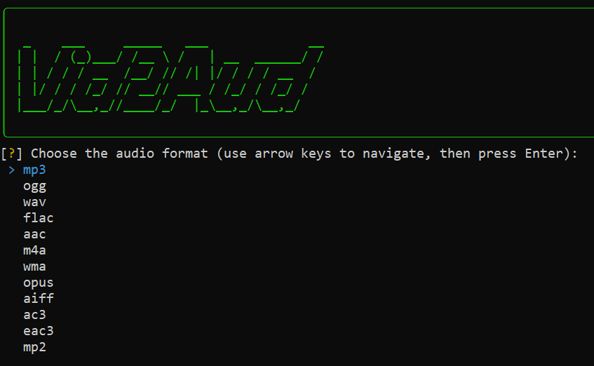

# Vid2Aud
This project is a Python-based, multiplatform tool that converts video files to audio files using the FFmpeg library. It supports multiple audio codecs and formats, and provides a user-friendly command-line interface with progress tracking.

<p align="center">
  
</p>

<p align="center">
  
</p>

## Compatibility

Vid2Aud is compatible with the following operating systems:
- Windows
- Linux
- Mac

## Features

- [x] Convert video files to audio files
- [x] Support for multiple audio codecs (e.g., `libfdk_aac`, `libshine`, `libtwolame`)
- [x] Progress tracking with rich console output
- [x] Error handling and informative messages
- [x] Multi-threaded processing for faster conversion
- [ ] Choose a specific audio codec

## Requirements

- Python 3.6+
- FFmpeg executable (`ffmpeg.exe` for Windows, `ffmpeg` for Linux/Mac)
- Required Python packages: `rich`, `inquirer`

## Installation

1. Clone the repository:
    ```sh
    git clone https://github.com/yourusername/Video-To-Audio-Converter.git
    cd Vid2Aud
    ```

2. (Optional) Create and activate a virtual environment:

    **Windows:**
    ```sh
    python -m venv venv
    venv\Scripts\activate
    ```

    **Linux/Mac:**
    ```sh
    python3 -m venv venv
    source venv/bin/activate
    ```

3. Install the required Python packages:
    ```sh
    pip install -r requirements.txt
    ```

4. Download and install FFmpeg:
    ### Windows
    - Go to the [FFmpeg download page](https://ffmpeg.org/download.html).
    - Download the appropriate version.
    - Extract the downloaded archive.
    - Copy the `ffmpeg.exe` executable to the project directory or add its location to your system's PATH.

    ### Linux

    1. Install FFmpeg using your package manager:

        ```sh
        sudo apt install ffmpeg         # On Debian, Ubuntu and Mint
        sudo yum install ffmpeg         # On RHEL/CentOS/Fedora and Rocky/AlmaLinux
        sudo emerge -a sys-apps/ffmpeg  # On Gentoo Linux
        sudo apk add ffmpeg             # On Alpine Linux
        sudo pacman -S ffmpeg           # On Arch Linux
        sudo zypper install ffmpeg      # On OpenSUSE
        sudo pkg install ffmpeg         # On FreeBSD
        ```

    ### macOS

    1. Install FFmpeg using your package manager:

        ```sh
        brew install ffmpeg # Via Homebrew
        sudo port install ffmpeg # Via MacPorts
        ```

## Usage

1. Place your video files in the `videoInput` folder.

2. Run the script:

    **Windows:**
    ```sh
    python Vid2Aud.py
    ```

    **Linux/Mac:**
    ```sh
    python3 Vid2Aud.py
    ```

3. Follow the prompts to select the audio ~~codec and~~ format.

4. The converted audio files will be saved in the `audioOutput` folder.

## Code Overview

### Main Functions

- `video_to_audio(video_path, audio_path, codec, format_choice)`: Converts a video file to an audio file using the specified codec and format.
- `process_file(filename, input_folder, output_folder, codec, extension, progress, task)`: Processes a single video file and converts it to audio.
- `print_starter_message()`: Prints an ASCII starter message when the script begins.
- `print_success_message()`: Prints an ASCII success message when the script completes.
- `print_no_files_message()`: Prints an ASCII message if no video files are found in the input folder.

## License

This project is licensed under the MIT License. See the [LICENSE](LICENSE) file for details.

## Contributing

Contributions are welcome! Please open an issue or submit a pull request for any improvements or bug fixes.

## Contact

For any questions or suggestions, please contact [gametutoytb@gmail.com](mailto:gametutoytb@gmail.com).
